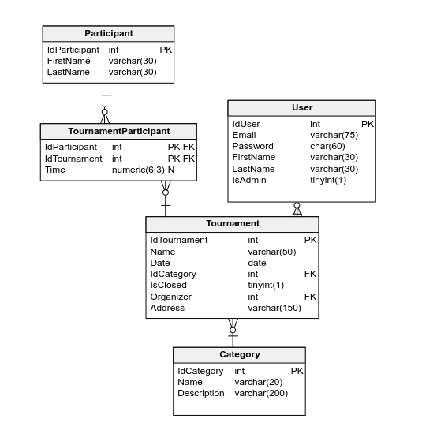

System zarządzania zawodami ze składania kostki Rubika
======================================================

Autor: Oleksii Yermolaiev s25653


Opis
----

### Schemat bazy danych


### Dostępne konta użytkowników
- `jan@tin.pl` - zwykły użytkownik
- `marta@tin.pl` - admin

Hasło dla obu: `testpassword`.

### Role użytkowników
- Niezalogowani - mogą wszystko przeglądać, ale nie mogą nic zmieniać
- Zalogowani - mogą tworzyć turnieje i edytować swoje turnieje
- Admini - mogą dodawać i usuwać kategorie i uczestników, edytować wszystkie turnieje

### Dwa języka
- Polski
- Angielski


Uruchomienie
------------

Frontend dostępny na: <http://localhost:5173/>.

### Baza danych
- Skrypt tworzenia bazy danych: `api/sql/create.sql`.
- Skrypt dodania przykładowych danych: `api/sql/seed.sql`.
- Skrypt usuwania stworzonych tabel: `api/sql/drop.sql`.

### API
```sh
cd api
npm install
npm start
```

### Fontend
```sh
cd api
npm install
npm run-script dev
```


Konfiguracja
------------

Konfiguracja połączenia z bazą danych i sekretów znajduje się w pliku `api/.env`.
